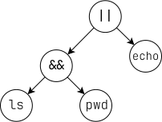

<div align="center">
	<h1>🐚 <s>minis</s><i>hell</i></h1>
	<p>This project is about creating a simple shell. Yes, your own little bash. You will learn a lot about processes and file descriptors.</p>
	
	<a href="https://developer.apple.com/library/archive/documentation/Performance/Conceptual/ManagingMemory/Articles/FindingLeaks.html">
		
	</a>
	
	<br />
	
</div>

## 📖 Table of Contents
<!--ts-->
* [⚙️ Usage](#usage)
	* [😫 Troubleshooting](#troubleshooting)
* [💯 Mandatory part](#mandatory-part)
	* [🛠️ Builtins](#builtins)
		* [`echo`](#echo)
		* [`cd`](#cd)
		* [`pwd`](#pwd)
		* [`export`](#export)
		* [`unset`](#unset)
		* [`env`](#env)
		* [`exit`](#exit)
	* [🔔 Signals](#signals)
		* [`Ctrl-C`](#ctrl-c)
		* [`Ctrl-D`](#ctrl-d)
* [🌟 Bonus part](#bonus-part)
	* [🌳 `&&` and `||`](#operators)
* [🙇🏻 Credits](#credits)
<!--te-->

## Usage

```bash
git clone https://github.com/leogaudin/minishell.git
cd minishell
make && ./minishell
```

### Troubleshooting

If you have an error when running `make`, it is probably because you do not have the `readline` library installed on your computer, or that it is not well linked.

There are a few ways to fix this, but ours was:

1. Install vagrant with brew

```bash
brew install vagrant
```

2. Install the `readline` library with brew

```bash
brew install readline
```

3. Create a symlink to the library

```bash
ln /opt/homebrew/Cellar/readline/8.2.1/lib/libreadline.8.dylib /usr/local/lib/libreadline.8.dylib
```

## Mandatory part

### Builtins

#### `echo`

#### `cd`

```c
int ft_cd(t_fullcmd fullcmd, char ***env)
{
	char	*path;
	char	*oldpath;
	char	*home;

	path = NULL;
	home = ft_getenv("HOME", *env);
	oldpath = ft_strdup(getcwd(NULL, 0));
	determine_path(&path, home, fullcmd, env);
	if (path == NULL)
		return (ft_printf("cd: HOME not set\n"), 1);
	if (change_path(path, fullcmd))
		return (1);
	path = ft_strdup(getcwd(NULL, 0));
	update_pwd(path, oldpath, env);
	return (free(path), free(oldpath), free(home), 0);
}
```

The `cd` command needs to take into account the current directory to be able to go back to it if the user wants to go back to the previous directory.

The `determine_path` function is used to handle the cases not handled by the `chdir` function, such as `cd -` or expanding the `~` token to `/Users/user_directory`.

The `change_path` function is used to change the current directory to the one specified by the user by calling the `chdir` function. It also handles the errors returned by `chdir`, for example if the directory does not exist.

It then updates the `PWD` and `OLDPWD` environment variables by calling the `update_pwd` function.

#### `pwd`

```c
int	ft_pwd(char **env)
{
	char	*wd;

	wd = ft_getenv("PWD", env);
	if (write(STDOUT_FILENO, wd, ft_strlen(wd)) < 0)
		return (ft_putendl_fd(strerror(errno), STDERR_FILENO), -1);
	if (write(STDOUT_FILENO, "\n", 1) < 0)
		return (ft_putendl_fd(strerror(errno), STDERR_FILENO), -1);
	return (0);
}
```

`pwd` simply fetches the value of the `PWD` environment variable and prints it.

#### `export`

#### `unset`

#### `env`

```c
int	ft_env(t_fullcmd fullcmd, char ***env)
{
	int	i;

	i = 0;
	if (fullcmd.argums[1] != NULL)
		return (ft_putendl_fd("The builtin env does not take arguments or options.", STDERR_FILENO), -1);
	while ((*env)[i])
	{
		printf("%s\n", (*env)[i]);
		i++;
	}
	return (0);
}
```

The `env` command simply iterates through the environment variables fetched at the entry of the program and prints them.

#### `exit`

```c
void ft_exit(t_fullcmd fullcmd, char ***env)
{
	int i;

	(void)env;
	i = 0;
	ft_putstr_fd("exit\n", STDOUT_FILENO);
	if (fullcmd.argums[1] != NULL && fullcmd.argums[2] != NULL)
		return (ft_putendl_fd("exit: too many arguments", STDERR_FILENO), (void)0);
	if (fullcmd.argums[1] != NULL)
	{
		while (fullcmd.argums[1][i])
		{
			if (ft_isdigit(fullcmd.argums[1][i]) == 0)
			{
				ft_putendl_fd("exit: numeric argument required", STDERR_FILENO);
				exit(255);
			}
			i++;
		}
		exit(ft_atoi(fullcmd.argums[1]));
	}
	exit(0);
}
```

The `exit` command is used to exit the shell. It takes into account the exit status specified by the user, and if it is not specified, it exits with the 0 exit status.

### Signals

#### `Ctrl-C`

```c
void sigint_handler(int sig)
{
	(void)sig;
	ft_putchar_fd('\n', 1);
    rl_replace_line("", 0);
    rl_on_new_line();
    rl_redisplay();
}
```

Handling the `Ctrl-C` signal is made easier by the use of the `readline` library, allowing us to clear the current line and display a new prompt seamlessly.

#### `Ctrl-D`

`Ctrl-D` actually prints an `EOF` character, we therefore only need to check if the line read by `readline` is empty to exit the shell.

## Bonus part

### Operators

The `&&` and `||` operators actually need to be handled carefully, as they can be chained together and that every command in the chain depends on the exit status of the previous one.

To achieve so, the most efficient way is to use an **Abstract Syntax Tree (AST)**.

Abstract Syntax Trees are often used to represent mathematical operations with priorities. For example $4 + 2 * 10 + 3 * (5 + 1)$ would be represented as:

<p align="center">
	
</p>

In our case, we will use an AST to represent the commands and operators entered by the user. For example, the command `ls && pwd || echo "Hello World"` would be represented as:

<p align="center">
	
</p>

#### Step-by-step

1. The `ls` command is executed.
2. The `pwd` command is executed if the `ls` command exited with a 0 exit status.
3. The `echo "Hello World"` command is executed if one of the `ls` **or** `pwd` commands exited with a non-zero exit status.


By traversing the AST, we can execute the commands in the right order, and we can also handle the `&&` and `||` operators' particularities properly.

### `*` wildcard expansion

## Credits

*🙇🏻‍♂️ This project has been done in great collaboration with [ysmeding](https://github.com/ysmeding).*
